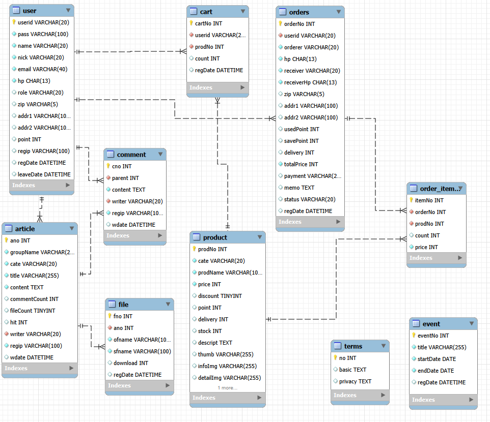
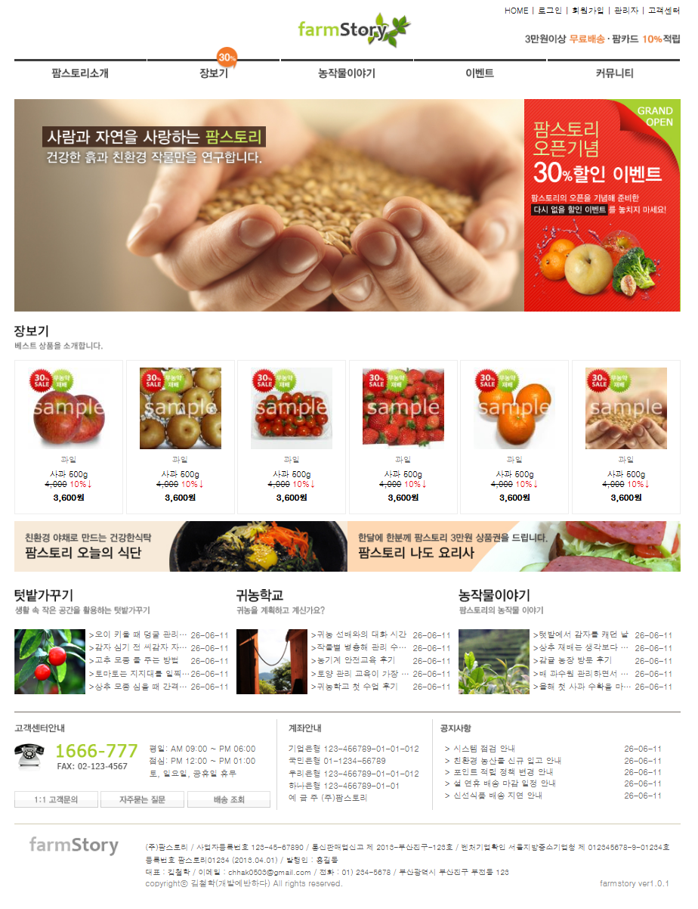

# 🌱 FarmStory

## 프로젝트 소개

FarmStory는 농산물 쇼핑몰과 커뮤니티 기능을 결합한 웹 애플리케이션입니다.

사용자는 회원가입 후 상품을 조회하고 주문할 수 있으며, 게시판을 통해 농작물 재배 경험과 정보를 공유할 수 있습니다.

또한 관리자 페이지를 통해 회원, 상품, 주문, 이벤트를 효율적으로 관리할 수 있도록 구현하였습니다.

---

## 개발 기간

- 2026.05 ~ 2026.06

---

## 기술 스택

### Backend

- Java
- JSP / Servlet
- JDBC

### Frontend

- HTML5
- CSS3
- JavaScript
- JSTL

### Database

- MySQL

### Server

- Apache Tomcat 10

### Library

- BCrypt
- jakarta mail
- jstl

---

## 주요 기능

### 회원

- 회원가입 및 로그인
- 이메일 인증
- 회원정보 수정
- 아이디, 비밀번호 찾기
- 회원 탈퇴

### 상품

- 상품 목록 및 상세 조회
- 상품 등록 / 수정 / 삭제
- 장바구니
- 주문 및 결제

### 게시판

- 게시글 CRUD
- 댓글 CRUD
- 파일 업로드 / 다운로드
- 검색 기능
- 페이지네이션

### 이벤트

- FullCalendar 기반 일정 관리
- 이벤트 등록 / 수정 / 삭제

### 관리자

- 회원 관리
- 상품 관리
- 주문 관리

---

## 역할 분담

| 담당자 | 담당 기능                |
| ------ | ------------------------ |
| 팀장   | 게시판, 이벤트, Git 관리 |
| 팀원 A | 상품                     |
| 팀원 B | 주문                     |
| 팀원 C | 관리자                   |

---

## 프로젝트 구조

```text
src/main/java
 ├─ controller
 ├─ service
 ├─ dao
 ├─ dto
 ├─ filter
 └─ util

src/main/webapp
 ├─ css
 ├─ js
 ├─ images
 └─ WEB-INF/views
```

MVC(Model2) 패턴을 기반으로 개발하였으며,

Controller → Service → DAO → Database 구조로 요청을 처리하고 JSP는 View 역할만 수행하도록 구성하였습니다.

---

## 주요 테이블

- user
- product
- cart
- orders
- order_item
- article
- comment
- file
- event
- terms

---

## ERD



---

## 화면 구성

<details>
<summary>📷 메인 페이지</summary>



</details>

```

```
